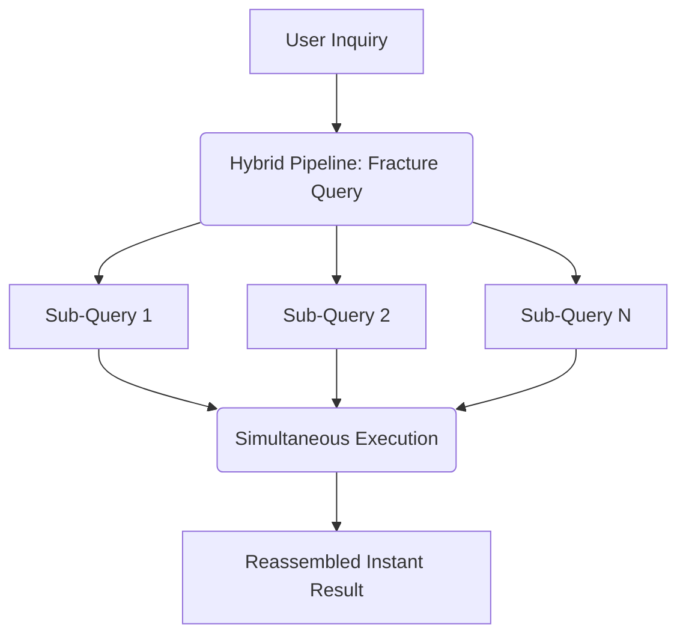

# 🪐 WeMon_dreamV1-I-BSL-1.0 🪐
### 🚀 *The Ultra-Performance Search Engine & Local Terminal Ecosystem*
---
> **⚡ Core Vision 2026:** A next-generation engine engineered for extreme speed, absolute privacy, and total local containment. Powered by an ultra-optimized hybrid runtime, containerized infrastructure, and instant semantic discovery.

---

## 📦 The "Extra Edition" Bundle
This repository represents the **Extra Edition**, extending beyond a standalone search engine into a multi-tiered workspace containing frontend suites, development environments, and modular sub-systems.

### 🌐 Frontend & Interface Layers
* 💻 **`react-deploy-template`** • Production-ready React dashboard framework optimized for search visualization.
* 📬 **`virtual_inbox_web`** • Sandboxed local web environment built for secure mock email ingestion.
* 🎮 **`xbox-beta`** • Experimental environment bridge designed for local console telemetry and integration.
* 📖 **`comic_book.html`** • Integrated local asset housing an interactive web-based reading interface.

### ⚙️ Engine Core & Architecture
* 🛡️ **`weMon_dreamV1-I-MPL-2.0`** • Legacy architectural snapshot preserved for engine baseline compatibility.
* 🐍 **`__pycache__`** • Optimized bytecode compilation layer providing instant terminal initialization.

### 🛠️ Python Packaging Pipeline (`uvan_zxZ_terminal.egg-info`)
* 📄 **`PKG-INFO`** • Formal package metadata and distribution specifications.
* 🗺️ **`SOURCES.txt`** • Internal engine source file tracking manifest.
* 🔗 **`dependency_links.txt`** • Isolated package resolution path matrices.
* 📋 **`requires.txt`** • Strict environment dependency tracking.
* 🗂️ **`top_level.txt`** • High-level namespace directory layout.

---

## 🦖 Boost Software License (BSL-1.0) Superpowers

* 🧱 **The Binary Loophole** • Free commercial and open usage. When compiled into machine binaries, users are legally exempt from providing copyright attribution or documentation.
* 📂 **Source Preservation** • Modification and distribution of raw source files require original copyright notices to remain intact.
* 🛡️ **Zero Corporate Hassle** • Eliminates administrative attribution requirements, making this codebase completely enterprise-friendly.

---

## 🧠 Engine Core Capabilities

* 🧠 **Semantic Deep-Indexing** • Eliminates filler words (`the`, `and`, `a`). Automatically maps matching concepts based on context rather than simple literal text matching.
* ⚡ **Hybrid Query Pipeline** • Fractures single inputs into concurrent sub-queries processed inside the same millisecond for immediate reassembly.
* 🔒 **Encrypted Isolation Mode** • Automatically detects missing local authentication files (`*.key`, `*.pem`), transitioning directly into a "Safe Mode Sandbox" simulation without crashing.
* 🧹 **Zero-Footprint Cache** • Background worker infrastructure purges stale cache logs continuously, preventing standard database degradation.

---

## 🛠️ Setup & Operations

### 📋 Prerequisites
* **Runtimes:** Node.js & Python Hybrid Stack
* **Package Managers:** `pnpm` / `npm` / `pip`
* **Virtualization:** Docker Desktop / Docker Compose

### 🚀 Staging Protocol
1. **Initialize:** Setup the root workspace directory structure.
2. **Conceal:** Verify `.gitignore` rules are active before inserting keys.
3. **Isolate:** Restrict environmental variables to `.env` or the `/secrets/` folder.
4. **Audit:** Execute `git status --ignored` to confirm complete isolation prior to staging upstream.
